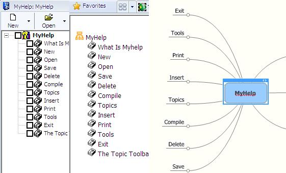



## Kimmo \- MyHelp

### Description

This is an update of my previous submission called MyHelp used to create help files. This version had been updated with the functionalities to export the tree structure to the Mindjet MindMapper application by creating a new mindmap and also the topics can be exported to a html page with graphics. The third part is that the topics now can be dragged and dropped in various places. Fixed some minor bugs, esp for creating individual files for each help topic and picture processing.
 
### More Info
 
To to able to use the mindmapper export functionality, you should have mindjet mindmapper installed in your computer as this used that type library. Also ensure that the Microsoft Help workshop is installed in the directory where you will run this source in a folder called \Help.

             |
---                |---
**Submitted On**   |2010-03-07 12:37:20
**By**             |[Anele Mbanga](https://github.com/Planet-Source-Code/PSCIndex/blob/master/ByAuthor/anele-mbanga.md)
**Level**          |Advanced
**User Rating**    |5.0 (15 globes from 3 users)
**Compatibility**  |VB 6\.0
**Category**       |[Complete Applications](https://github.com/Planet-Source-Code/PSCIndex/blob/master/ByCategory/complete-applications__1-27.md)
**World**          |[Visual Basic](https://github.com/Planet-Source-Code/PSCIndex/blob/master/ByWorld/visual-basic.md)
**Archive File**   |[Kimmo\_\-\_My2176893122010\.zip](https://github.com/Planet-Source-Code/anele-mbanga-kimmo-myhelp__1-71118/archive/master.zip)

